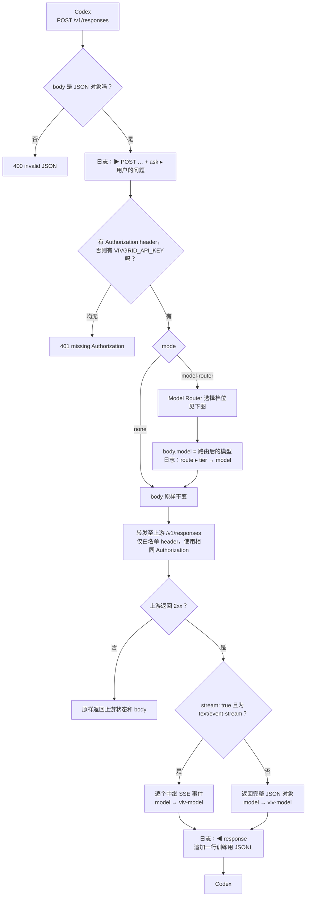
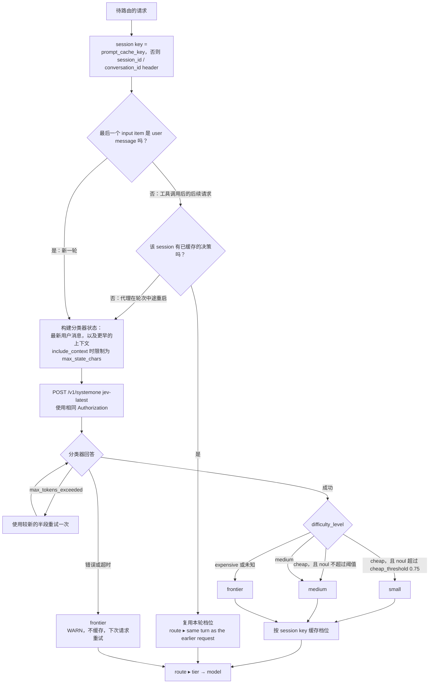

# vg-model-router（Vivgrid Model Router）

[English](README.md)

面向 [Codex](https://github.com/openai/codex) 的本地 LLM API 代理。

它会在本机暴露 OpenAI **Responses API**（`POST /v1/responses`），并将每个请求原样转发至 `https://api.vivgrid.com/v1/responses`，同时支持流式和非流式模式。唯一会修改的响应内容是模型 ID：Codex 收到的每个 `model` 都会加上 `viv-` 前缀（见 [模型 ID 前缀](#model-id-prefix)）。

启用可选的 [Model Router](#model-router) 后，代理还会按 small / medium / frontier 三个档位为每一轮选择上游模型。

每个请求各有一条入站和出站日志。出现异常时——例如响应未完成或历史记录存在未配对的工具调用——日志会标为 **WARN**，并附带状态、token 用量和请求工具摘要。

<a id="how-it-works"></a>
## 工作原理

一个请求进来，一个请求出去。代理只会改写 `model`，不会触碰 body 中的其他内容。



### 对一轮请求进行路由

<a id="routing-a-turn"></a>
在 [Model Router](#model-router) 模式（`mode = "model-router"`）下，每轮会插入一次分类器调用。Codex 在每次工具调用后发送的后续请求会复用该轮的档位，因此同一轮中不会切换模型。



每次分类器调用都会记录日志，无论成功或失败；见 [Model Router → 日志](#logs)。

<a id="quick-start"></a>
## 快速开始

### 1. 下载并运行

提供适用于 macOS（Apple Silicon）的预构建二进制。下载后在本地运行：

```bash
curl -L -o vg-model-router https://github.com/fanweixiao/vg-model-router-gateway/releases/download/v0.1/vg-model-router
chmod +x vg-model-router
xattr -d com.apple.quarantine vg-model-router 2>/dev/null   # 仅通过浏览器下载时需要
./vg-model-router
# INFO vg-model-router listening on http://127.0.0.1:33333  →  upstream https://api.vivgrid.com/v1/responses
```

使用 Codex 时请保持这个终端开启，日志会显示在这里。

<details>
<summary>或从源码构建</summary>

需要 Rust 1.88+（edition 2024）。

```bash
cargo build --release
./target/release/vg-model-router
```

如需去除符号的 Apple Silicon 二进制，见[为 macOS 构建 release 二进制](#building-a-release-binary-for-macos-apple-silicon)。

</details>

### 2. 将 Codex 指向代理

编辑 `~/.codex/config.toml`：

```toml
model_provider = "local"
model = "gpt-6-astra"

[model_providers.local]
name = "Local Proxy"
base_url = "http://127.0.0.1:33333/v1"
experimental_bearer_token = "<VIVGRID_API_KEY>"
```

- `base_url` 必须与代理的监听地址一致，且包含 `/v1`。
- `experimental_bearer_token` 是你的 vivgrid API key。Codex 会以 `Authorization: Bearer ...` 发送它，代理会原样转发至上游。
- `model` 会原样透传（可使用 vivgrid 接受的任意模型名，不要加 `viv-` 前缀）。在 Model Router 模式下，它会被路由后的模型替换。

之后照常运行 `codex`，并在代理终端中查看日志。

<a id="building-a-release-binary-for-macos-apple-silicon"></a>
## 为 macOS 构建 release 二进制（Apple Silicon）

Apple Silicon（M1/M2/M3/M4…）的 target triple 是 `aarch64-apple-darwin`。

**使用 make（推荐）**

```bash
make release   # 添加 target、构建、strip、输出架构与大小
               # → target/aarch64-apple-darwin/release/vg-model-router
make install   # 同时复制至 ~/.local/bin（可用 PREFIX=/usr/local/bin 覆盖）
```

**手动执行**

```bash
# 1. 添加 target（Apple Silicon Mac 上通常已经安装）
rustup target add aarch64-apple-darwin

# 2. 构建优化后的二进制
cargo build --release --target aarch64-apple-darwin

# 3. 检查架构
file target/aarch64-apple-darwin/release/vg-model-router
# → Mach-O 64-bit executable arm64
```

在 Apple Silicon Mac 上，直接运行 `cargo build --release` 也会在 `target/release/` 生成 arm64 二进制。显式传递 `--target` 仍有帮助：Intel Mac 上也能使用，并能明确输出路径。

**可选：缩小体积并安装**

```bash
# 去除调试符号（约 8.6 MB → 约 6.8 MB）
strip target/aarch64-apple-darwin/release/vg-model-router

# 加入 PATH
mkdir -p ~/.local/bin
cp target/aarch64-apple-darwin/release/vg-model-router ~/.local/bin/
vg-model-router
```

**将二进制复制到另一台 Mac**

自行构建的二进制不会被隔离。若通过 AirDrop、浏览器下载或聊天工具发给另一台 Mac，Gatekeeper 可能会提示“无法打开，因为无法验证开发者”。在那台机器上运行：

```bash
xattr -d com.apple.quarantine ./vg-model-router
```

<a id="configuration"></a>
## 配置

所有设置均为可选环境变量：

| 变量 | 默认值 | 说明 |
|---|---|---|
| `LISTEN` | `127.0.0.1:33333` | 代理监听的地址 |
| `https://api.vivgrid.com/v1/responses` | `https://api.vivgrid.com/v1/responses` | 上游 Responses endpoint；`/v1/models` 从此地址推导 |
| `RUST_LOG` | `vg_model_router=info` | 日志级别。`vg_model_router=debug` 还会记录发送到上游及从上游收到的完整请求/响应 body，以及每个 SSE 事件类型 |
| `CONFIG` | `./vg-model-router.toml` | 配置文件路径（见 [Model Router](#model-router)） |
| `VIVGRID_API_KEY` | – | vivgrid API key。仅当入站请求没有 `Authorization` header 时才作为兜底使用；随后同时用于上游调用和分类器 |

示例：

```bash
RUST_LOG=vg_model_router=debug LISTEN=127.0.0.1:40000 ./target/release/vg-model-router
```

### `.env` 文件

启动时，代理也会读取**当前目录**中的 `.env` 和 `.env.local`（若存在）。优先级从高到低为：

1. shell 中已设置的变量；
2. `.env.local`；
3. `.env`。

两个文件均被 git 忽略。请从模板开始：

```bash
cp .env.example .env
```

任何无法解析的行都会使启动失败。日志会显示实际加载的文件（`environment loaded from .env.local, .env`）。

<a id="model-router"></a>
## Model Router

在配置文件中设置 `mode = "model-router"` 后，代理会自行选择上游模型。每当一轮开始时，它会向分类器（[typesafe](https://api.typesafe.ai) 的 `systemone`）询问请求难度，再据此路由：

| 分类器结果 | 路由到 |
|---|---|
| `difficulty_level = cheap` 且 `prefer_cheap_model.noul > cheap_threshold`（0.75） | `small` |
| `difficulty_level = cheap` 但 `noul` 更低，或 `difficulty_level = medium` | `medium` |
| 其他任何情况，或分类器失败 / 超时 | `frontier` |

- **每轮只分类一次。** 最后一个 `input` item 为用户消息的请求会开启新一轮并被分类。Codex 在每次工具调用后发送的后续请求会复用该轮模型（键为 `prompt_cache_key`，否则是 `session_id` / `conversation_id` header），从而避免一轮中途切换模型并保持 prompt cache 有效。若代理在轮次中途重启，下一个请求会再次分类。
- **分类器看到的内容。** 最新的一条真实用户消息。启用 `include_context = true`（默认）时，还会包含较早的用户/助手消息、工具调用和经裁剪的工具输出；不包含 `instructions`、developer/system 消息、reasoning item 以及 Codex 注入的 `<environment_context>` / AGENTS.md 消息。文本被限制为 `max_state_chars`，优先丢弃最旧上下文。分类器若仍报告 `max_tokens_exceeded`，代理会使用较新的半段重试一次。
- **两次调用使用相同 key。** 分类器请求（vivgrid 上的 `jev-latest`）与上游 `/v1/responses` 调用使用相同的 `Authorization` header：优先 Codex 发来的值，若未发送则使用 `VIVGRID_API_KEY`。不存在单独的分类器 key。
- **只修改 `model`。** 路由后的模型替换请求 body 中的 `model`，其他字段原样透传。
- **响应的 `model`。** Codex 收到实际提供服务的模型 ID，但带有 `viv-` 前缀（例如 `viv-gpt-5.6-luna`）。

### 配置

将 [`vg-model-router.example.toml`](vg-model-router.example.toml) 复制为 `./vg-model-router.toml`，或传入 `--config <path>`（也可设置 `CONFIG`）。TOML 中不应写 API key：分类器使用正在路由的请求的 `Authorization` header（兜底方式见 [`.env` 文件](#env-files)）：

```bash
cp vg-model-router.example.toml vg-model-router.toml
./vg-model-router
```

没有配置文件时，`mode` 为 `none`，代理行为与之前一致。

<a id="logs"></a>
### 日志

每次分类器调用都会记录日志，且每个请求在上游调用前都有一条路由日志。分类器失败时，两者均为 **WARN**：

```
INFO #2 ⇢ jev-1.13.0  [0.25s, in 538 / out 77]   answer ▸ (conf 1.00 | chp 0.00, med 0.00, exp 1.00), scr 3.99 (conf 0.83), noul 0.09
INFO #2 ⇢ route  [requested model=gpt-6-astra]
    route  ▸ frontier → gpt-6-astra  (classified by jev-1.13.0 in 0.25s; expensive)
INFO #3 ⇢ route  [requested model=gpt-6-astra]
    route  ▸ frontier → gpt-6-astra  (same turn as #2)
```

分号后的文本是由上表选出该档位的规则。当 verdict 与档位看似不一致时很有用，例如 `cheap but noul 0.43 ≤ 0.75` 会路由到 `medium`。缓存决策没有自己的规则；`same turn as #N` 指向作出该决策的请求。

<a id="training-data"></a>
### 训练数据

每个已路由请求都会作为一行 JSON 追加到 `log_path`（默认为 `vg-model-router.jsonl`）。每一行包含路由决策、分类器输入与答案、Responses 请求（`instructions`、`input`、`tools`），以及模型的完整响应（`model`、`status`、`output`、`incomplete_details`、`usage`、`error`）。记录的 `model` 是不带 `viv-` 前缀的上游模型。

可将其导出为用于 LoRA 微调的 JSONL。两种导出均使用大多数微调工具期望的 Chat `messages` 格式。SFT 导出会在导出时将 Responses item 转换为 Chat message：

```bash
# 训练自己的路由器：分类器输入 → {"difficulty_level", "difficulty_score", "prefer_cheap_model"}
./vg-model-router export router --in vg-model-router.jsonl --out router.jsonl

# 蒸馏 frontier 模型：完整对话（含工具）→ 它的回复。
# 仅导出 status = completed 且 output 非空的请求。
# --with-reasoning 会将纯文本 reasoning（summary / content）保留为 reasoning_content；加密 reasoning 无法导出。
./vg-model-router export sft --in vg-model-router.jsonl --out sft.jsonl [--tier frontier|medium|small|all] [--with-reasoning]
```

注意：Codex 会在每个请求中重发完整历史记录，因此日志增长很快。

<a id="endpoints"></a>
## Endpoints

| 方法和路径 | 说明 |
|---|---|
| `POST /v1/responses`（也支持 `/responses`） | 透传至上游 `/v1/responses`；支持 `stream: true` 和 `stream: false`。响应的 `model` 会加 `viv-` 前缀 |
| `GET /v1/models` | 透传至上游 `/v1/models` |
| `GET /health` | 返回 `ok` |

<a id="headers-forwarded-upstream"></a>
## 转发至上游的 Headers

只有以下 header 会发给上游，Codex 发送的其他 header 会被丢弃。

| 入站 header | 上游收到的 header |
|---|---|
| `Authorization` | `Authorization`（不变） |
| `User-Agent` | `User-Agent`（不变） |
| `session_id` | `x-viv-session_id` |
| `x-codex-turn-metadata` | `x-viv-meta` |

如需重命名更多 header，请在 `src/main.rs` 的 `HEADER_RENAMES` 中添加对应 pair。

<a id="reading-the-logs"></a>
## 阅读日志

```
INFO #1 ▶ GET /v1/models  [→ https://api.vivgrid.com/v1/models]
INFO #1 ◀ GET /v1/models  [200, 0.33s]
INFO #3 ▶ POST /v1/responses  [stream, model=gpt-5.6-luna, input_items=24, tools=6]
    ask    ▸ (34 chars) print the user's question in the log
INFO #3 ◀ response  [stream, 8.42s, model=gpt-5.6-luna → viv-gpt-5.6-luna]
```

每轮的首个请求会运行分类器，并额外增加两行：

```
INFO #3 ⇢ jev-1.13.0  [0.55s, in 538 / out 77]   answer ▸ (conf 0.55 | chp 0.71, med 0.29, exp 0.00), scr 1.10 (conf 0.67), noul 0.43
INFO #3 ⇢ route  [requested model=viv-auto]
    route  ▸ medium → gpt-5.6-terra  (classified by jev-1.13.0 in 0.55s; cheap but noul 0.43 ≤ 0.75)
```

正常请求会产生两条日志（发生分类的轮次则为四条）。其他详细信息仅在该日志行为 **WARN** 时打印：

```
WARN #4 ▶ POST /v1/responses  [stream, model=gpt-5.6-luna, input_items=24, tools=6]
    tools  ▸ declared (6): shell(command, workdir, timeout_ms) [function], apply_patch [custom], [web_search], ...
             parallel_tool_calls=false
             in input: 5 calls (shell ×4, apply_patch ×1), 5 outputs  ⚠ 1 call without output
    items  ▸ message:developer ×1, message:user ×3, reasoning ×5, function_call ×4, custom_tool_call ×1, function_call_output ×4, custom_tool_call_output ×1
WARN #4 ◀ response  [stream, 8.42s, model=gpt-5.6-luna → viv-gpt-5.6-luna]
    stop   ▸ status = incomplete  | reason = max_output_tokens
    output ▸ reasoning ×1, function_call ×1
    usage  ▸ inp: 8,029, cd-inp: 6,144 (76.5%), opt: 212 (reasoning: 64)
```

每个请求均有编号（`#1`、`#2`、…），并以方法和路径开始。在终端中，按编号从 8 种颜色中选择一种为该请求的每条日志着色，因此即使并发请求的 `▶` / `⇢` / `◀` 行交错，也能阅读同一请求。stdout 不是终端（重定向到文件或 pipe）或设置了 `NO_COLOR` 时不会输出颜色。`GET /v1/models` 仅产生一对单行请求/响应日志；`GET /health` 只会在 `RUST_LOG=vg_model_router=debug` 下记录，避免健康检查淹没日志。未知路径的请求会记录为 `WARN unhandled route: <method> <uri>`。

**请求行（`▶`）** —— 每个请求都会打印 `ask`；仅当历史记录有未配对工具调用时才打印 `tools` 和 `items` 块，同时该行也会成为 **WARN**。
- `ask ▸`：**用户实际输入的问题**——最新真实用户消息，以字符数和首 200 个字符在一行显示（空白折叠）。不包括其他内容：没有 `instructions`（系统提示在每个请求中都相同）、没有对话历史、没有工具输出。它与分类器接收的消息相同，因此下方的路由决策针对的就是这段文本。Codex 注入的 `<environment_context>` / `<user_instructions>` / AGENTS.md 消息会被跳过。同一轮内的请求（工具循环）都会显示该轮的问题。`<no user message>` 表示该请求完全没有用户消息；压缩和标题生成便是这种形式，可据此与真实轮次区分。
- `tools ▸ declared`：请求中声明的每个工具；函数显示参数名，工具类型显示在方括号内。
- `in input`：对话历史中重放的工具调用与输出。
- `⚠ calls without output` / `⚠ outputs without call`：历史中存在未配对的工具调用。这会触发 WARN 和两个详细信息块。
- `items ▸`：按类型统计的每个 input item（message 按 role 分开）。字符串形式的 `input` 会显示为一条 user message。
- 上游错误时，发给上游的精确 body 会保存至 `$TMPDIR/vg-model-router-req-<id>.json`，日志会打印用于重放的 `curl` 命令。

**分类器行（`⇢ <model>`）** —— **每一次调用**分类器都会打印，毫无例外：成功为 INFO，失败为 WARN。它是路由决策的唯一输入，因此不会像其他细节一样被抑制。方括号中依次为回答的模型版本（来自响应；失败时为配置的 `jev-latest`）、延迟、token 用量，以及重试时的 `attempt N`。`answer ▸` 承载响应中除 `legend` 外的一切：`conf` 是分类器对选择的置信度，随后是各档位概率（`chp` / `med` / `exp`），`scr` 是 0–4 的难度分数及自身置信度，`noul` 是 `prefer_cheap_model`。选中的档位不会在此重复；它会显示在下方路由行和实际采用的规则中。状态过长导致 `max_tokens_exceeded` 时会重试一次，因此会有两次调用且都会打印日志。原始请求文本和响应 body 可在 `RUST_LOG=vg_model_router=debug` 下查看。

**路由行（`⇢ route`）** —— 决策本身，以及分号后产生该决策的规则（见 [Model Router](#model-router)）；因此即使 `cheap` verdict 被路由到 `medium`，也可解释原因。`same turn as #N` 表示复用了缓存决策，未发生分类器调用，所以其上方没有 `⇢ <model>` 行。分类器失败且请求降级为 `frontier` 时为 WARN。

**响应行（`◀`）** —— 仅在状态不是 `completed` 或出现 note 时打印 `stop`、`output`、`usage` 和 `note`，同时该行也会成为 **WARN**。包括安静成功请求在内的每个请求 token 用量都在训练日志中（见 [训练数据](#training-data)）。
- `model`：上游报告的模型，以及 Codex 收到的模型（带 `viv-` 前缀）。
- `stop`：最终响应 `status`（`completed` / `incomplete` / `failed`），若存在还会包括 `incomplete_details.reason` 或 `error.message`。流式模式中它来自 `response.completed` / `response.incomplete` / `response.failed` 事件。
- `output`：按类型统计的输出 item。
- `usage`：`inp` = input tokens，`cd-inp` = cached input tokens（含命中率），`opt` = output tokens（含 reasoning tokens）。`n/a` 表示上游未报告该字段。
- `note`：任意异常事件：流在没有最终 `response.*` 事件时结束、上游发送 `error` 事件、客户端断开连接，或 `stream: true` 收到非 SSE 回复。
- 当 status 不是 `completed` 或出现任何 note 时，响应行会记录为 **WARN**。

上游 HTTP 错误会将相同的 status、`content-type` 和 body 返回给 Codex。不是 JSON object 的请求 body 会以 `400` 拒绝。

<a id="model-id-prefix"></a>
## 模型 ID 前缀

代理从 `/v1/responses` 返回的每个模型 ID 都会获得 `viv-` 前缀：

- **非流式：**响应对象顶层的 `model`。
- **流式：**每个携带 response object 的 SSE 事件中的 `response.model`（`response.created`、`response.in_progress`、`response.completed`、`response.incomplete`、`response.failed`）。

只有携带 model 的 `data:` 行会重新序列化。其他所有行（`event:` 行、delta 事件、`[DONE]`）均逐字节转发。已以 `viv-` 开头的 ID 保持不变。`GET /v1/models` 不会修改。前缀定义在 `src/stream.rs` 的 `MODEL_PREFIX` 中。

<a id="limitations"></a>
## 限制

- 只有 `Authorization`、`User-Agent` 与 `HEADER_RENAMES` 中的 header 会转发到上游（见上文）。
- 请求 body 会逐字节转发；只有 Model Router 模式会在替换 `model` 后重新序列化。

<a id="project-layout"></a>
## 项目结构

```
src/
├── main.rs      # HTTP 服务、路由、header 转发、非流式路径
├── stream.rs    # SSE 中继：转发上游事件，并给 model 加 viv- 前缀
├── report.rs    # 日志格式化：请求/工具、状态、用量
├── convert.rs   # Responses → Chat 转换，仅用于 `export sft`
├── config.rs    # 配置文件（mode、[model-router]）
├── router.rs    # Model Router：分类器调用、路由规则、按轮缓存
└── trainlog.rs  # 训练数据 JSONL 日志及 `export`
```
