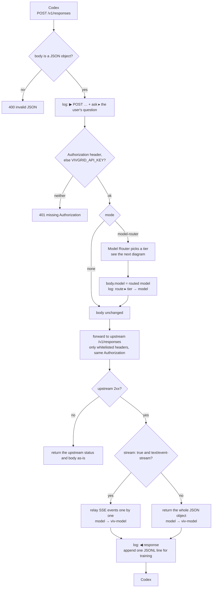
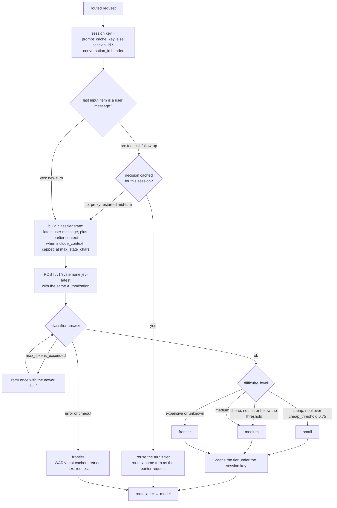

# vg-model-router (Vivgrid Model Router)

A local LLM API proxy for [Codex](https://github.com/openai/codex).

It exposes the OpenAI **Responses API** (`POST /v1/responses`) on your machine and passes each request through unchanged to `https://api.vivgrid.com/v1/responses`, in both streaming and non-streaming mode. The only change to the response is the model ID: every `model` Codex gets back has a `viv-` prefix (see [Model ID prefix](#model-id-prefix)).

With the optional [Model Router](#model-router), the proxy also picks the upstream model for each turn from a small / medium / frontier tier.

Each request gets one log line in, one out. When something is off — the response did not complete, or the history has unpaired tool calls — the line is logged as **WARN** and carries the details: status, token usage, and a summary of the tools in the request.

## How it works

One request in, one request out. The proxy only ever rewrites `model` — nothing else in the body is touched.



### Routing a turn

[Model Router](#model-router) mode (`mode = "model-router"`) inserts one classifier call per turn. The follow-up requests Codex sends after each tool call reuse that turn's tier, so a turn never switches models halfway.



Every classifier call is logged, success or failure — see [Model Router → Logs](#logs).

## Quick start

### 1. Download and run

Prebuilt binary for macOS (Apple Silicon). Download it and run it locally:

```bash
curl -L -o vg-model-router https://github.com/fanweixiao/vg-model-router-gateway/releases/download/v0.1/vg-model-router
chmod +x vg-model-router
xattr -d com.apple.quarantine vg-model-router 2>/dev/null   # only needed if downloaded via a browser
./vg-model-router
# INFO vg-model-router listening on http://127.0.0.1:33333  →  upstream https://api.vivgrid.com/v1/responses
```

Keep this terminal open while you use Codex. Logs show up here.

<details>
<summary>Or build from source</summary>

Requires Rust 1.88+ (edition 2024).

```bash
cargo build --release
./target/release/vg-model-router
```

For a stripped Apple Silicon binary, see [Building a release binary for macOS](#building-a-release-binary-for-macos-apple-silicon).

</details>

### 2. Point Codex at the proxy

Edit `~/.codex/config.toml`:

```toml
model_provider = "local"
model = "gpt-6-astra"

[model_providers.local]
name = "Local Proxy"
base_url = "http://127.0.0.1:33333/v1"
experimental_bearer_token = "<VIVGRID_API_KEY>"
```

- `base_url` must match the proxy's listen address, including `/v1`.
- `experimental_bearer_token` is your vivgrid API key. Codex sends it as `Authorization: Bearer ...`, and the proxy forwards it upstream unchanged.
- `model` is passed through unchanged (use any model name vivgrid accepts, without the `viv-` prefix). In Model Router mode it is replaced by the routed model.

Then run `codex` as usual and watch the proxy's terminal for logs.

## Building a release binary for macOS (Apple Silicon)

The target triple for Apple Silicon (M1/M2/M3/M4…) is `aarch64-apple-darwin`.

**With make (recommended)**

```bash
make release   # add target, build, strip, print arch & size
               # → target/aarch64-apple-darwin/release/vg-model-router
make install   # also copy it to ~/.local/bin (override with PREFIX=/usr/local/bin)
```

**By hand**

```bash
# 1. Add the target (already installed if you're on an Apple Silicon Mac)
rustup target add aarch64-apple-darwin

# 2. Build an optimized binary
cargo build --release --target aarch64-apple-darwin

# 3. Check the architecture
file target/aarch64-apple-darwin/release/vg-model-router
# → Mach-O 64-bit executable arm64
```

On an Apple Silicon Mac, a plain `cargo build --release` also produces an arm64 binary, in `target/release/`. Passing `--target` is still useful: it works from an Intel Mac too, and it keeps the output path explicit.

**Optional: make it smaller and install it**

```bash
# Strip debug symbols (~8.6 MB → ~6.8 MB)
strip target/aarch64-apple-darwin/release/vg-model-router

# Put it on your PATH
mkdir -p ~/.local/bin
cp target/aarch64-apple-darwin/release/vg-model-router ~/.local/bin/
vg-model-router
```

**Copying the binary to another Mac**

A binary you build yourself is not quarantined. If you send it to another Mac (AirDrop, browser download, chat), Gatekeeper may block it with *"cannot be opened because the developer cannot be verified"*. On that machine, run:

```bash
xattr -d com.apple.quarantine ./vg-model-router
```

## Configuration

All settings are optional environment variables:

| Variable | Default | Description |
|---|---|---|
| `LISTEN` | `127.0.0.1:33333` | Address the proxy listens on |
| `https://api.vivgrid.com/v1/responses` | `https://api.vivgrid.com/v1/responses` | Upstream Responses endpoint. `/v1/models` is derived from it |
| `RUST_LOG` | `vg_model_router=info` | Log level. `vg_model_router=debug` also logs the full request/response bodies sent to and received from upstream, and the type of each SSE event |
| `CONFIG` | `./vg-model-router.toml` | Config file path (see [Model Router](#model-router)) |
| `VIVGRID_API_KEY` | – | Your vivgrid API key. Fallback, used **only** when the incoming request has no `Authorization` header. It then applies to both the upstream call and the classifier |

Example:

```bash
RUST_LOG=vg_model_router=debug LISTEN=127.0.0.1:40000 ./target/release/vg-model-router
```

### `.env` files

At startup the proxy also reads `.env` and `.env.local` from the **current directory**, if they exist. Precedence, highest first:

1. variables already set in the shell;
2. `.env.local`;
3. `.env`.

Both files are git-ignored. Start from the template:

```bash
cp .env.example .env
```

A line that can't be parsed stops startup with an error. The log shows which files were loaded (`environment loaded from .env.local, .env`).

## Model Router

With `mode = "model-router"` in the config file, the proxy picks the upstream model itself. For each new turn it asks a classifier ([typesafe](https://api.typesafe.ai) `systemone`) how hard the request is, then routes it:

| Classifier result | Routed to |
|---|---|
| `difficulty_level = cheap` and `prefer_cheap_model.noul > cheap_threshold` (0.75) | `small` |
| `difficulty_level = cheap` with lower `noul`, or `difficulty_level = medium` | `medium` |
| anything else, or the classifier failed / timed out | `frontier` |

- **One classification per turn.** A request whose last `input` item is a user message starts a new turn and is classified. The follow-up requests Codex sends after each tool call reuse that turn's model (keyed by `prompt_cache_key`, else the `session_id` / `conversation_id` header), so a turn never switches models halfway and the prompt cache keeps working. If the proxy restarts mid-turn, the next request is classified again.
- **What the classifier sees.** The latest real user message. With `include_context = true` (the default), earlier user/assistant messages, tool calls and trimmed tool outputs go with it. `instructions`, developer/system messages, reasoning items and Codex's injected `<environment_context>` / AGENTS.md messages are left out. The text is capped at `max_state_chars`, and the oldest context is dropped first. If the classifier still reports `max_tokens_exceeded`, the proxy retries once with the newer half.
- **Same key for both calls.** The classifier request (`jev-latest` on vivgrid) is sent with the same `Authorization` header as the upstream `/v1/responses` call — the one Codex sent, or `VIVGRID_API_KEY` when it sent none. There is no separate classifier key.
- **Only `model` changes.** The routed model replaces `model` in the request body. Every other field is passed through unchanged.
- **Response `model`.** Codex receives the real model ID that served the request, with the `viv-` prefix (e.g. `viv-gpt-5.6-luna`).

### Configuration

Copy [`vg-model-router.example.toml`](vg-model-router.example.toml) to `./vg-model-router.toml`, or pass `--config <path>` (or set `CONFIG`). No API key goes in the TOML file: the classifier uses the `Authorization` header of the request being routed (see [`.env` files](#env-files) for the fallback):

```bash
cp vg-model-router.example.toml vg-model-router.toml
./vg-model-router
```

Without a config file, `mode` is `none` and the proxy behaves as before.

### Logs

Every call to the classifier is logged, and each request gets a route line before the upstream call. Both are **WARN** when the classifier failed:

```
INFO #2 ⇢ jev-1.13.0  [0.25s, in 538 / out 77]   answer ▸ (conf 1.00 | chp 0.00, med 0.00, exp 1.00), scr 3.99 (conf 0.83), noul 0.09
INFO #2 ⇢ route  [requested model=gpt-6-astra]
    route  ▸ frontier → gpt-6-astra  (classified by jev-1.13.0 in 0.25s; expensive)
INFO #3 ⇢ route  [requested model=gpt-6-astra]
    route  ▸ frontier → gpt-6-astra  (same turn as #2)
```

The text after the semicolon is the rule from the table above that picked the tier — useful when the verdict and the tier don't obviously match, e.g. `cheap but noul 0.43 ≤ 0.75` routing to `medium`. A cached decision has no rule of its own; `same turn as #N` points at the request that made it.

### Training data

Every routed request is appended to `log_path` (default `vg-model-router.jsonl`) as one JSON line. Each line holds the routing decision, the classifier input and answers, the Responses request (`instructions`, `input`, `tools`), and the model's full response (`model`, `status`, `output`, `incomplete_details`, `usage`, `error`). The logged `model` is the upstream one, without the `viv-` prefix.

Export it as LoRA fine-tuning JSONL. Both exports use the Chat `messages` format most fine-tuning tools expect. The SFT export converts Responses items to Chat messages at export time:

```bash
# Train your own router: classifier input → {"difficulty_level", "difficulty_score", "prefer_cheap_model"}
./vg-model-router export router --in vg-model-router.jsonl --out router.jsonl

# Distill the frontier model: full conversation (+ tools) → its reply.
# Only requests with status = completed and a non-empty output are exported.
# --with-reasoning keeps plain-text reasoning (summary / content) as reasoning_content; encrypted reasoning can't be exported.
./vg-model-router export sft --in vg-model-router.jsonl --out sft.jsonl [--tier frontier|medium|small|all] [--with-reasoning]
```

Heads-up: Codex resends the whole history on every request, so the log grows quickly.

## Endpoints

| Method & path | Description |
|---|---|
| `POST /v1/responses` (also `/responses`) | Passed through to upstream `/v1/responses`; supports `stream: true` and `stream: false`. Response `model` gets the `viv-` prefix |
| `GET /v1/models` | Passed through to upstream `/v1/models` |
| `GET /health` | Returns `ok` |

## Headers forwarded upstream

Only these headers go to the upstream. Everything else from Codex is dropped.

| Incoming header | Sent upstream as |
|---|---|
| `Authorization` | `Authorization` (unchanged) |
| `User-Agent` | `User-Agent` (unchanged) |
| `session_id` | `x-viv-session_id` |
| `x-codex-turn-metadata` | `x-viv-meta` |

To rename more headers, add pairs to `HEADER_RENAMES` in `src/main.rs`.

## Reading the logs

```
INFO #1 ▶ GET /v1/models  [→ https://api.vivgrid.com/v1/models]
INFO #1 ◀ GET /v1/models  [200, 0.33s]
INFO #3 ▶ POST /v1/responses  [stream, model=gpt-5.6-luna, input_items=24, tools=6]
    ask    ▸ (34 chars) print the user's question in the log
INFO #3 ◀ response  [stream, 8.42s, model=gpt-5.6-luna → viv-gpt-5.6-luna]
```

On the first request of a turn, the classifier runs and adds two more lines:

```
INFO #3 ⇢ jev-1.13.0  [0.55s, in 538 / out 77]   answer ▸ (conf 0.55 | chp 0.71, med 0.29, exp 0.00), scr 1.10 (conf 0.67), noul 0.43
INFO #3 ⇢ route  [requested model=viv-auto]
    route  ▸ medium → gpt-5.6-terra  (classified by jev-1.13.0 in 0.55s; cheap but noul 0.43 ≤ 0.75)
```

A normal request is two log entries (four on a turn that classified). The other details are printed only when the line is a **WARN**:

```
WARN #4 ▶ POST /v1/responses  [stream, model=gpt-5.6-luna, input_items=24, tools=6]
    tools  ▸ declared (6): shell(command, workdir, timeout_ms) [function], apply_patch [custom], [web_search], ...
             parallel_tool_calls=false
             in input: 5 calls (shell ×4, apply_patch ×1), 5 outputs  ⚠ 1 call without output
    items  ▸ message:developer ×1, message:user ×3, reasoning ×5, function_call ×4, custom_tool_call ×1, function_call_output ×4, custom_tool_call_output ×1
WARN #4 ◀ response  [stream, 8.42s, model=gpt-5.6-luna → viv-gpt-5.6-luna]
    stop   ▸ status = incomplete  | reason = max_output_tokens
    output ▸ reasoning ×1, function_call ×1
    usage  ▸ inp: 8,029, cd-inp: 6,144 (76.5%), opt: 212 (reasoning: 64)
```

Every request is numbered (`#1`, `#2`, …) and opens with its method and path. On a terminal, each entry is tinted with one of 8 colors picked by that number, so the lines of one request stay readable even though concurrent requests interleave their `▶` / `⇢` / `◀` lines. Colors are dropped when stdout isn't a terminal (redirected to a file or piped) or when `NO_COLOR` is set. `GET /v1/models` gets a one-line request/response pair; `GET /health` is only logged at `RUST_LOG=vg_model_router=debug`, so health checks don't flood the log. A request to an unknown path is logged as `WARN unhandled route: <method> <uri>`.

**Request line (`▶`)** — `ask` is printed for every request; the `tools` and `items` blocks are printed only when the history has unpaired tool calls, which also makes the line a **WARN**.
- `ask ▸`: **the question the user actually typed** — the latest real user message, as character count and the first 200 characters on one line (whitespace collapsed). Nothing else: no `instructions` (the system prompt is identical on every request), no conversation history, no tool output. It is the same message the classifier is asked about, so the routing decision below it is about this text. Codex's injected `<environment_context>` / `<user_instructions>` / AGENTS.md messages are skipped. Requests inside one turn (the tool loop) all show that turn's question. `<no user message>` means the request has none at all — compaction and title generation look like this, which is what tells them apart from a real turn.
- `tools ▸ declared`: every tool in the request, with parameter names for functions and the tool type in brackets.
- `in input`: tool calls and outputs replayed in the conversation history.
- `⚠ calls without output` / `⚠ outputs without call`: the history has unpaired tool calls. This is what triggers the WARN and the two detail blocks.
- `items ▸`: every input item counted by type (messages split by role). A string `input` is shown as one user message.
- On an upstream error, the exact body sent upstream is saved to `$TMPDIR/vg-model-router-req-<id>.json`, and the log prints a `curl` command to replay it.

**Classifier line (`⇢ <model>`)** — printed for **every single call** to the classifier, no exceptions: INFO on success, WARN on failure. It is the only input to the routing decision, so it is never suppressed the way the other details are. The brackets hold the model version that answered (from the response; the configured `jev-latest` if the call failed), the latency, the token usage, and `attempt N` on a retry. `answer ▸` carries everything the response returned except `legend`: `conf` is the classifier's confidence in its choice, then the per-tier probabilities (`chp` / `med` / `exp`), `scr` is the 0–4 difficulty score with its own confidence, and `noul` is `prefer_cheap_model`. The chosen tier itself is not repeated here — it is on the route line below, together with the rule that used it. An over-long state gets one retry on `max_tokens_exceeded` — that is two calls, and both print a line. Raw request text and response body are logged at `RUST_LOG=vg_model_router=debug`.

**Route line (`⇢ route`)** — the decision, and after the semicolon the rule that produced it ([Model Router](#model-router)), so a `cheap` verdict that still routed to `medium` explains itself. `same turn as #N` means the cached decision was reused and no classifier call happened, which is why there is no `⇢ <model>` line above it. WARN when the classifier failed and the request fell back to `frontier`.

**Response line (`◀`)** — `stop`, `output`, `usage` and `note` are printed only when the status is not `completed` or a note appeared, which also makes the line a **WARN**. Token usage for every request, including the quiet ones, is in the training log ([Training data](#training-data)).
- `model`: the model upstream reported, and what Codex received (with the `viv-` prefix).
- `stop`: the final `status` of the response (`completed` / `incomplete` / `failed`), plus `incomplete_details.reason` or `error.message` when present. In streaming mode it comes from the `response.completed` / `response.incomplete` / `response.failed` event.
- `output`: output items by type.
- `usage`: `inp` = input tokens, `cd-inp` = cached input tokens (with hit rate), `opt` = output tokens (with reasoning tokens). `n/a` means upstream didn't report that field.
- `note`: any abnormal event: the stream ended without a final `response.*` event, upstream sent an `error` event, the client disconnected, or `stream: true` got a non-SSE reply.
- The response line is logged as **WARN** when the status is not `completed` or any note appears.

Upstream HTTP errors are returned to Codex with the same status, `content-type` and body. A request body that isn't a JSON object is rejected with `400`.

## Model ID prefix

Every model ID the proxy returns from `/v1/responses` gets a `viv-` prefix:

- **Non-streaming:** the top-level `model` of the response object.
- **Streaming:** `response.model` in every SSE event that carries a response object (`response.created`, `response.in_progress`, `response.completed`, `response.incomplete`, `response.failed`).

Only `data:` lines that carry a model are re-serialized. Every other line (`event:` lines, delta events, `[DONE]`) is forwarded byte for byte. IDs that already start with `viv-` are left alone. `GET /v1/models` is not changed. The prefix lives in `MODEL_PREFIX` in `src/stream.rs`.

## Limitations

- Only `Authorization`, `User-Agent` and the headers in `HEADER_RENAMES` are forwarded upstream (see above).
- The request body is forwarded byte for byte, except in Model Router mode, where it is re-serialized after `model` is replaced.

## Project layout

```
src/
├── main.rs      # HTTP server, routes, header forwarding, non-stream path
├── stream.rs    # SSE relay: forwards upstream events, adds the viv- prefix to model
├── report.rs    # Log formatting: request/tools, status, usage
├── convert.rs   # Responses → Chat conversion, used only by `export sft`
├── config.rs    # Config file (mode, [model-router])
├── router.rs    # Model Router: classifier call, routing rules, per-turn cache
└── trainlog.rs  # Training-data JSONL log and `export`
```
